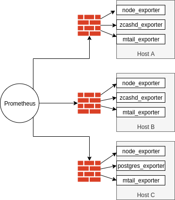
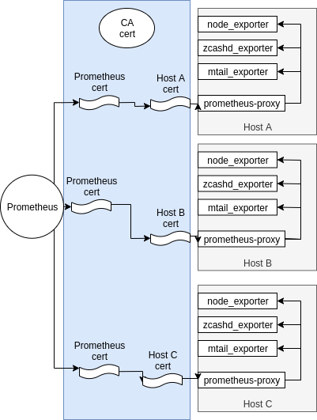

# prometheus-proxy

A reverse proxy for prometheus targets to authenticate metric requests.

## The problem

When deploying prometheus metric collection across the internet, you may want to restrict access to target endpoints.



With a static instances, this can be accomplished with firewall rules. This solution does not work when source addresses are dynamic, and the prometheus collectors change.

## A solution

The prometheus-proxy allows hosts to expose a single port for all local exporters, and secure access through TLS certificates.



In the new configuration, prometheus connect to the `prometheus-proxy` with a client certificate signed by a central CA. Each `prometheus-proxy` instances runs with a server certificate signed byt the same CA.

Prometheus validates the server certificate is valid by referencing the CA's public certificate.

Prometheus-proxy validates the prometheus client certificate against the same CA.

# Advantages

- No more firewall rules (ok, 1 for the prometheus-proxy)
- Fully dynamic endpoints, we just need to update DNS and as long as the cerfiicates validate, everything continues to work

# Usage

## Build the binary

```
go get github.com/benzcash/prometheus-proxy
```

## Generate certs

Either bring your own, or follow these steps for Debian/Ubuntu

```
sudo apt install golang-cfssl
git clone https://github.com/benzcash/prometheus-proxy.git
cd prometheus-proxy/certs
# Generate CA cert
cfssl genkey -initca ca-csr.json | cfssljson -bare ca

# Generate proxy cert, signed by ca
cfssl gencert -ca ./ca.pem -ca-key ./ca-key.pem -hostname=127.0.0.1,proxy ./proxy-csr.json | cfssljson -bare proxy

# Generate promethues client cert, signed by ca
cfssl gencert -ca ./ca.pem -ca-key ./ca-key.pem -hostname=prometheus ./prometheus-csr.json  | cfssljson -bare prometheus
```

## Start the prometheus-proxy

```
/prometheus-proxy --ca.cert certs/ca.pem --cert.file=certs/proxy.pem --key.file=certs/proxy-key.pem
```

## Configure prometheus to use the proxy port

You'll need to specify the port for the desired collector as a query parameters.

For Example:
```
scrape_configs:
  - job_name: 'nodes'
    tls_config:                     ## REQUIRED
      ca_file: ca.pem               ## The CA certificate generated
      cert_file: prometheus.pem     ## The client certificate issues byt the CA 
      key_file: prometheus-key.pem  ## The coresponding client certificate key
    scheme: https                   ## REQUIRED - by default all checks are http
    params:                         ## REQUIRED - these are the parameters sent to the proxy
      exporter-port:                ##   The parameter names the proxy expects (currently static
        - "9100"                    ##   The port of the exporter you want to access
    static_configs:
    - targets: ['127.0.0.1:9443']   ## The proxy address and port
    relabel_configs:                ## This is for convience
    - source_labels: [__address__]  ##   With this configuration, the "instance" label will
      regex: ^(.*):(.*)$            ##     be the same across all node exporters
      target_label: instance        ##   Adding this relabel just drops the port on the instance name
```
